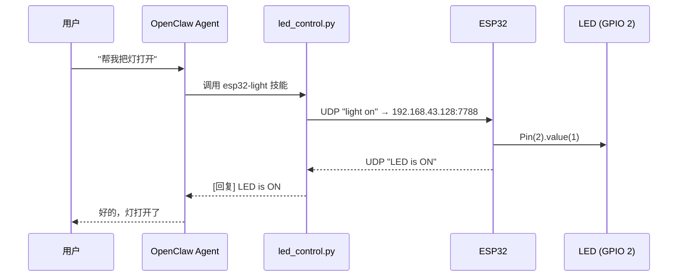

# ESP32Claw

> 为 ESP32 开发 OpenClaw 可以控制的 Skills，探索智能物联网的可能性。

让 AI Agent 用**自然语言**直接控制物理世界：说一句「帮我把灯打开」，灯就亮了。

`esp32-light` 是仓库中的第一个技能，打通了 **自然语言 → Agent → 局域网 UDP → ESP32 → GPIO 引脚** 的完整链路。通过局域网 UDP 通信协议连接 ESP32（MicroPython 固件），实现 Agent 指令对物理 GPIO 引脚的控制。

在此基础上验证了两件事：

- 基于**本地大模型**，可以构建隐私安全的自然语言实时控制、场景设置、程序编写能力
- 在**消费级平台**上构建本地物联网智能终端 AIoT 是可行的，并由此探索出未来的**云边端协同 AIoT 智能机器人架构**

## 交互示例

```text
用户：  帮我把灯打开
Agent： → 调用 esp32-light 技能
        → UDP 发送 "light on" 到 192.168.43.128:7788
        ← 收到 "LED is ON"
Agent： 好的，灯打开了
```

## 架构



分层来看：

| 层 | 承担者 | 职责 |
|---|---|---|
| 交互层 | 用户 ↔ OpenClaw Agent | 自然语言理解、意图识别、结果回述 |
| 技能层 | `esp32-light/` | 把意图映射为确定的控制指令 |
| 传输层 | 局域网 UDP | 主机与 ESP32 之间的命令与回执 |
| 设备层 | ESP32（MicroPython） | 解析指令、驱动 GPIO、回送执行结果 |

## 为什么值得做

### 产品亮点

1. **消费级可用**，市场潜力巨大
2. **跨生态互通**：Skills 层统一控制，摆脱生态，万物协作
3. **自然语言实时编程**，个性化技能和场景应用

### 解决痛点

1. 厂商生态封闭，设备难联动
2. 预设自动化功能固化，智能程度低
3. 纯云端方案存在隐私与延迟问题

## 快速开始

### 1. 准备硬件

- ESP32 开发板，已烧录 **MicroPython 固件**
- LED 及其限流电阻，接在 **GPIO 2** 引脚
- 一个手机热点，让 ESP32 与运行 Agent 的电脑处于**同一局域网**

### 2. 烧录 ESP32 端

把 `ESP32/main.py` 烧录到开发板，并按自己的环境修改两处：

- WiFi 热点名与密码（`wlan.connect(...)`）
- 静态 IP 配置（`STATIC_CONFIG`，默认 `192.168.43.128`，网关与 DNS 为 `192.168.43.1`）

### 3. 准备主机端

- Python 3.x，仅使用标准库 `socket`，**无需安装第三方依赖**
- 确认 `esp32-light/led_control.py` 中的 `ESP32_IP` 与固件里的静态 IP 一致

### 4. 先手动验证链路

```bash
python esp32-light/led_control.py status
```

看到 `[回复] LED is ON` 或 `[回复] LED is OFF`，说明链路已通。

### 5. 接入 OpenClaw

把 `esp32-light/` 目录作为技能放进 OpenClaw 的技能目录，Agent 即可通过自然语言调用它。

## 技能说明：esp32-light

### 命令映射

| 用户意图 | 发送命令    | ESP32 回复                  | 回复用户                 |
| -------- | ----------- | --------------------------- | ------------------------ |
| 开灯     | `light on`  | `LED is ON`                 | 好的，灯打开了           |
| 关灯     | `light off` | `LED is OFF`                | 好的，灯关闭了           |
| 查询状态 | `status`    | `LED is ON` 或 `LED is OFF` | 灯是开着的 / 灯是关着的  |

### 通信协议

- **协议**：UDP
- **ESP32 IP**：`192.168.43.128`（固定，代码中硬编码）
- **ESP32 端口**：`7788`
- **命令格式**：纯字符串文本

### 可靠性设计

为确保系统可靠性、规避 UDP 丢包带来的状态不明，ESP32 端设计了**返回系统**与**超时系统**：执行完成后主动回送结果，OpenClaw 自动读取并回复用户；若回送超时，则明确提醒用户，而不是静默失败。

### 自然语言示例

用户可以说：

- **开灯**：「帮我打开 ESP32 的灯」「开灯」
- **关灯**：「把灯关掉」「关灯」
- **查询状态**：「查询一下 LED 的状态」「查询一下灯的状态」「灯开着的吗？」

Agent 会理解这些意图并自动调用对应命令。

### 故障排除

| 现象 | 排查方向 |
|---|---|
| 收不到回复 | ① ESP32 是否已连上 WiFi ② IP 是否为 `192.168.43.128` ③ 电脑与 ESP32 是否同一局域网 ④ ESP32 上的 UDP 服务是否在运行 |
| 连接不上热点 | ① 热点是否已开启 ② WiFi 密码是否正确 ③ 尝试重启 ESP32 |

## 本地大模型部署建议

1. 为实现**降低成本**与**隐私安全**，推荐使用本地大模型。实测 `qwen3.5 4B` 模型即可完成技能使用、场景设置与组合技能程序编写。
2. 结合 OpenClaw 的**本地记忆功能**，用户可在消费级平台（8GB 以上显卡）完成本地智能家庭 AIoT 的布置。
3. 本地模型推理推荐 **llama.cpp**，性能相比 ollama 提升近五倍；使用 **Q4_K_M 量化**可大幅降低模型体积，实测 RTX 5060 8GB 显卡独占时最高支持 9B 模型。
4. 本地大模型对**复杂规划**能力较弱，可引入云端大模型补齐这一环。

## 云边端协同（探索方向）

本地小模型擅长实时响应但复杂规划弱，云端大模型规划强但存在隐私与延迟顾虑。两者结合即为云边端协同架构：

- **云端**大模型：复杂任务规划
- **端侧**中模型：实时技能控制、隐私脱敏
- **边侧**小模型：实时感知与动作系统

## 目录结构

```text
ESP32Claw/
├── ESP32/
│   └── main.py            # ESP32 端固件（MicroPython）：连 WiFi、监听 UDP、驱动 GPIO
├── esp32-light/
│   ├── SKILL.md           # 技能定义：触发场景、命令映射、故障排除
│   └── led_control.py     # 主机端脚本：把命令意图转成 UDP 报文并读取回执
├── LICENSE
└── README.md
```

## 已知限制

- 目前仅覆盖**单个 LED（GPIO 2）**，是打通链路的最小实现
- ESP32 的 IP 为硬编码，更换网络环境需同时修改固件与 `led_control.py`
- WiFi 凭据与静态 IP 写在固件源码中，正式部署建议做配置分离
- UDP 为不可靠传输，状态一致性依赖上层的返回与超时机制来保证

## License

MIT，详见 [LICENSE](LICENSE)。
